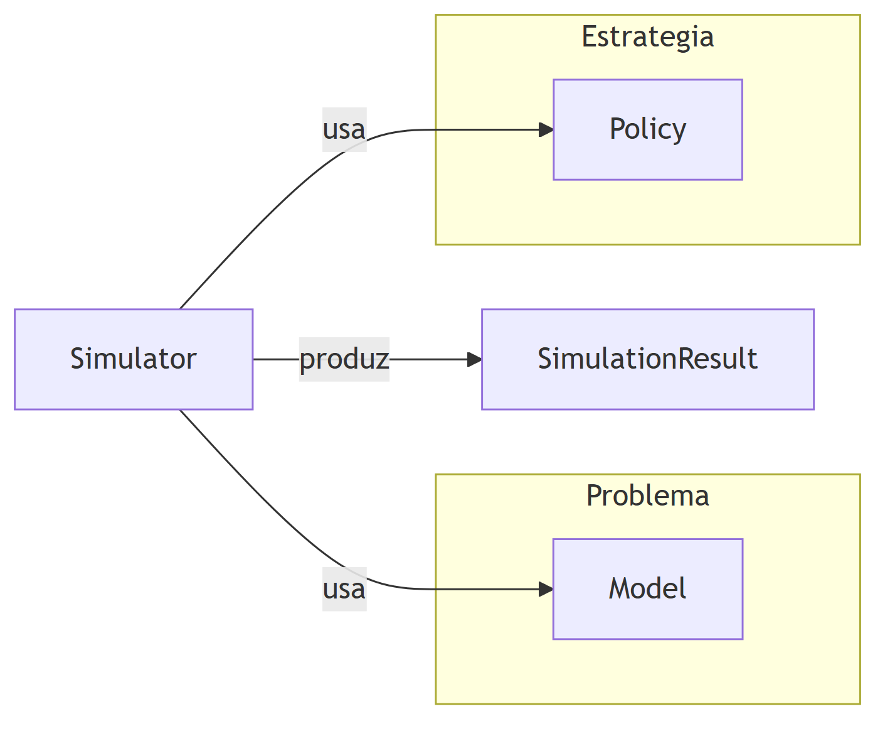

# pysdm — Sequential Decision Modeling

A small, composable Python implementation of Warren B. Powell's **Universal Modeling Framework** (UMF) for sequential decisions under uncertainty, from the book *Sequential Decision Analytics and Modeling* (Powell, 2024).

The design follows the sklearn/numpy style: describe the **problem** once (`Model` + declarative `State`), plug in any **strategy** (`Policy`), and let the `Engine` run, measure and record it.



## Installation

Requires Python 3.11+.

```bash
git clone https://github.com/lasseufpa/Sequential-Decision-Analytics-Modeling.git
cd Sequential-Decision-Analytics-Modeling
git checkout pysdm
pip install -e ".[analysis]"
```

`[analysis]` adds pandas + matplotlib (needed for `RunResult.to_frame()` and plotting). For development (tests, linting):

```bash
pip install -e ".[dev]"
```

Smoke test:

```bash
python -c "import pysdm; print(pysdm.__version__)"
python -m pytest tests -q
```

## The five elements of the UMF

Every sequential decision problem is described by the same five elements:

| Element | Notation | In pysdm |
|---|---|---|
| State | $S^n$ | subclass of `pysdm.State` (declarative attributes) |
| Decision | $x^n$ | returned by a `Policy` |
| Exogenous information | $W^{n+1}$ | `Model.exogenous_info()` or an `ExogenousSource` |
| Transition function | $S^{n+1} = S^M(S^n, x^n, W^{n+1})$ | `Model.transition()` |
| Objective function | $\max_\pi \mathbb{E}\left[\sum_n C(S^n, x^n, W^{n+1})\right]$ | `Model.objective()` |

## Quick start

An inventory problem in ~30 lines:

```python
import pysdm as sd

class InventoryState(sd.State):
    resource: float

class InventoryModel(sd.Model):
    def __init__(self, price, cost, demand_mean, demand_std):
        self.price, self.cost = price, cost
        self.demand_mean, self.demand_std = demand_mean, demand_std

    def initial_state(self):
        return InventoryState(resource=0.0)

    def exogenous_info(self, state, decision, rng):
        return max(0.0, rng.normal(self.demand_mean, self.demand_std))

    def transition(self, state, decision, exog_info):
        return state.replace(resource=max(0.0, state.resource + decision - exog_info))

    def objective(self, state, decision, exog_info):
        sold = min(state.resource + decision, exog_info)
        return self.price * sold - self.cost * decision

engine = sd.Engine(
    model=InventoryModel(price=45, cost=30, demand_mean=60, demand_std=10),
    policy=sd.ThresholdPolicy(theta_min=80, theta_max=110),
    horizon=30,
    random_state=42,
)
result = engine.run(episodes=1000)
print(result.mean_reward, result.quantiles([0.05, 0.95]))
```

## What's in the box

| Area | Classes |
|---|---|
| Problem description | `Model`, `State`, `Decision`, `ExogenousInfo` |
| Exogenous data sources | `ModelSource`, `DatasetSource`, `CallableSource` |
| Built-in policies | `ThresholdPolicy`, `GreedyPolicy`, `UCBPolicy`, `IEPolicy`, `ThompsonSamplingPolicy` |
| Learned policies | `ForwardADPPolicy` (+ `TabularValueFunction`) |
| Execution | `Engine`, `RunResult`, `History`, `StepRecord` |
| Monitoring | `Metric`, `MetricSet`, `EpisodeReward`, `CumulativeByStep`, `DecisionTime`, `Callback`, `ProgressLogger` |
| Reproducibility | `check_random_state`, `spawn_generators` (NumPy `Generator`-based) |

All policies follow the sklearn convention: constructor takes hyperparameters, `get_params()`/`set_params()` supported, learned policies expose `fit()`.

## Examples

Two complete, runnable chapter examples from the book:

```bash
python examples/ch04_diabetes_bandits.py    # Ch. 4 — multi-armed bandits (diabetes medication)
python examples/ch08_energy_storage_adp.py  # Ch. 8 — energy storage with Forward ADP
```

Each compares several policies on the same model and saves a plot next to the script.

## Writing your own problem

1. Declare a `State` subclass with the attributes your decision needs.
2. Subclass `Model` and implement the four hooks: `initial_state`, `exogenous_info`, `transition`, `objective`.
3. Pick a built-in `Policy` or subclass `Policy` and implement `decide(state, model, rng)`.
4. Run it with `Engine(model=..., policy=..., horizon=..., random_state=...)`.

The framework validates your model up front (missing methods, wrong signatures, invalid state attributes) and raises specific exceptions (`ModelDefinitionError`, `InvalidDecisionError`, ...) with actionable messages.

For the full design rationale and module-by-module reference, see [ARCHITECTURE.md](ARCHITECTURE.md).

## Tests

```bash
python -m pytest tests -q
```

31 tests covering elements, model validation, engine integration, policies and ADP learning.

## Bibliography

- Powell, W. B. (2024). *Sequential Decision Analytics and Modeling*. Now Publishers.
